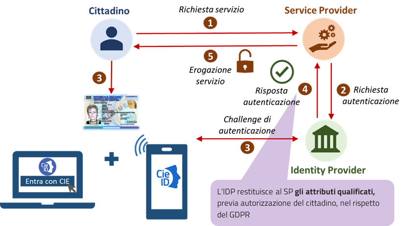
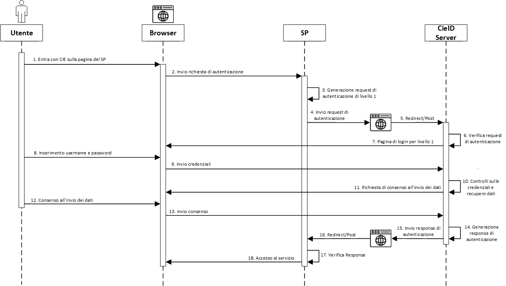
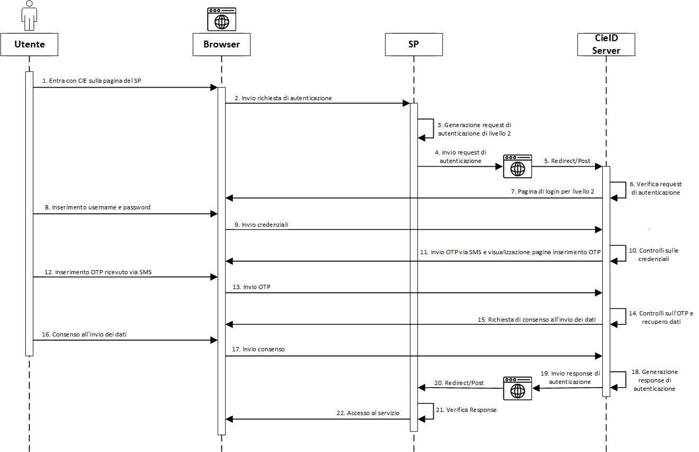
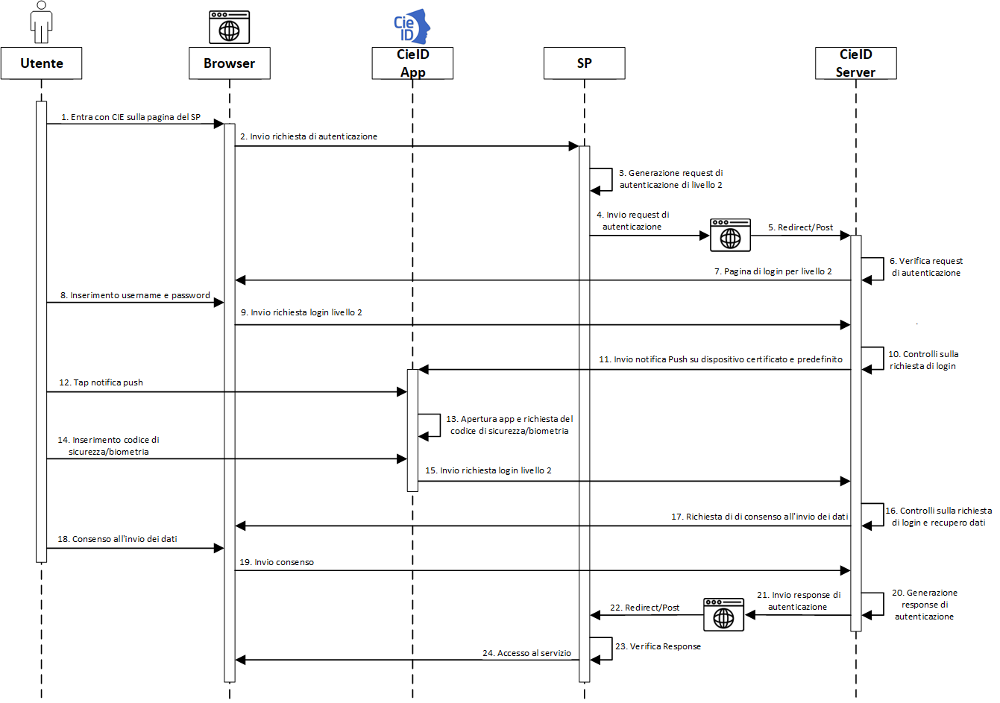
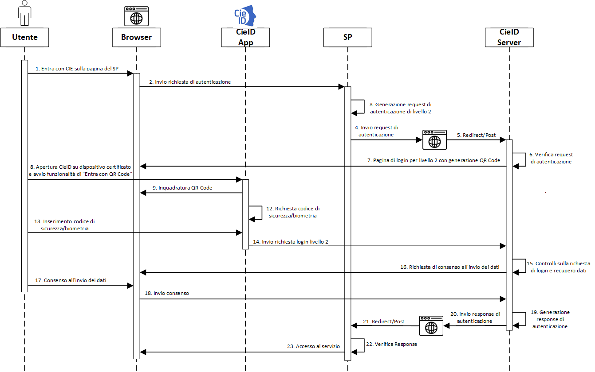
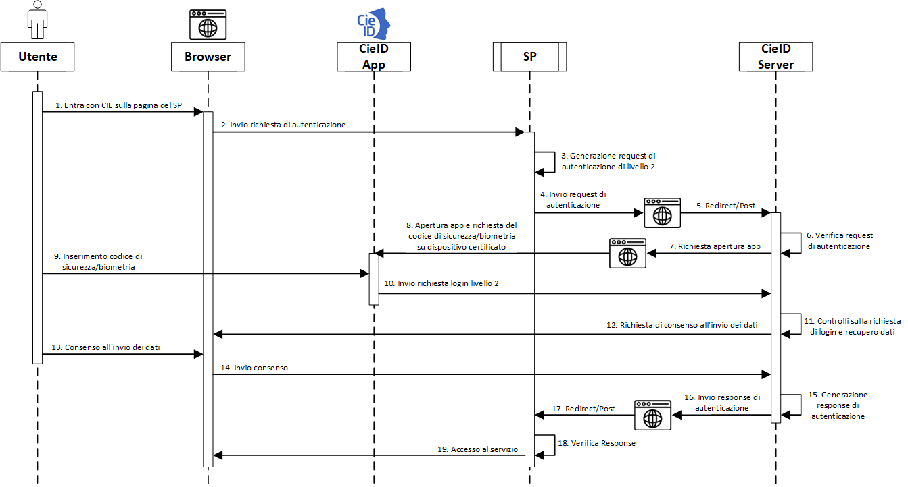
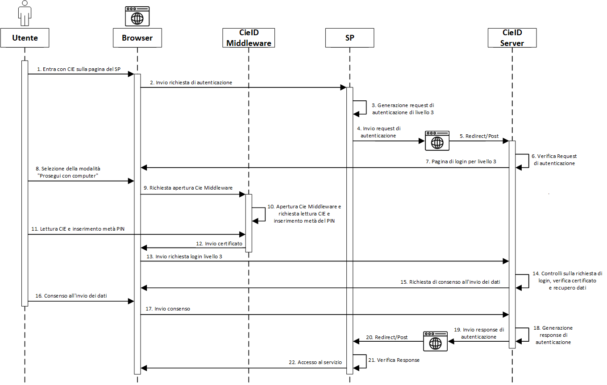
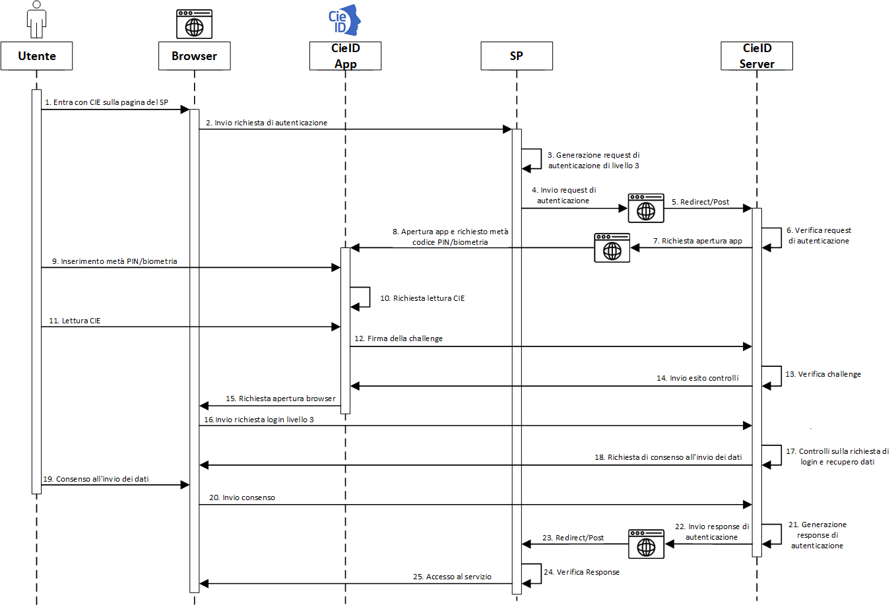
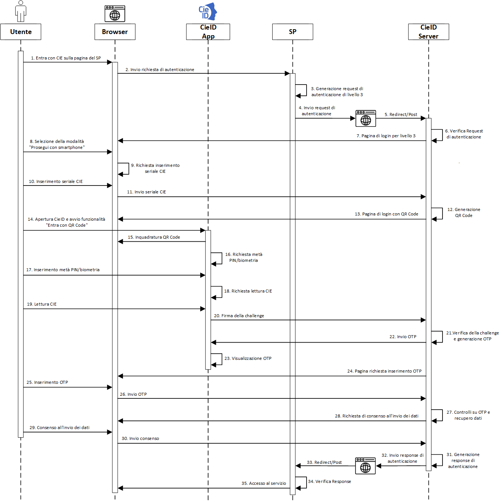

==============================
Soluzione eID basata sulla CIE
==============================

Lo schema di autenticazione “\ *Entra con CIE*\ ” segue il modello
dell'identità federata e dunque prevede l'introduzione di un Identity Provider (IdP), al quale i
fornitori di servizi online, Service Provider (SP), richiedono, previa
federazione, la verifica dell'identitá dell'utente.

In particolare, lo schema prevede l'istituzione di un IdP unico, il Ministero
dell'Interno, che in qualità di ente responsabile dell'emissione della
CIE, ne cura anche gli aspetti legati all'impiego del documento e delle
credenziali di livello basso e significativo ad esso connesso, come
strumento di identità digitale. Di seguito viene mostrato uno schema
logico della soluzione eID basata sulla CIE.

L'accesso mediante la CIE ai servizi erogati in rete dalle PP.AA. è reso
possibile attraverso il CieID Server, sito presso il Ministero
dell'Interno. Tale componente
server, che si configura tanto come un server SAML 2.0 che come un
OpenID Provider (OP), è realizzato e manutenuto dal Poligrafico e Zecca
dello Stato S.p.A. (PZS) che riveste il ruolo di partner tecnologico del
Ministero dell'Interno. Il CieID Server svolge le seguenti funzioni:

-  Accetta richieste di autenticazione SAML o OIDC a servizi digitali
   erogati da enti federati ed inviate attraverso il protocollo HTTPS;

-  Effettua l'identificazione informatica dell'utente mediante
   l'esecuzione della fase di challenge secondo il livello di sicurezza
   richiesto dal SP ovvero scelto dall'utente;

-  Nel caso di accesso mediante livello di sicurezza “alto”, verifica la
   validità del certificato a bordo della CIE cooperando con la CA
   Autenticazione;

-  Invia gli attributi qualificati all'erogatore
   di servizio previo consenso esplicito da parte dell'utente;

-  Invia all'erogatore di servizio una asserzione di autenticazione firmata dal Ministero dell'Interno; tale
   asserzione costituisce prova di avvenuto riconoscimento dell'utente da
   parte di CieID Server e del Ministero stesso.

.. note::
   L'interazione con l'utente da parte della componente CieID Server, puó avvenire secondo diverse modalitá:

   -  **Modalitá «desktop»:** l'utente si autentica mediante un browser installato sul proprio computer. Nel caso di accesso di livello 3, utilizza la CIE mediante un lettore RF collegato al computer

   -  **Modalitá «smartphone»**: l'utente si autentica al servizio tramite un browser installato su un dispositivo mobile (smartphone o tablet) dotato dell'app CieID. Nel caso di accesso di livello 3, il dispositivo mobile deve essere necessariamente dotato di interfaccia NFC. In tale circostanza la fase di autenticazione si completa avvicinando la CIE al proprio dispositivo;

   -  **Modalitá «desktop + smartphone»**: l'utente si autentica al servizio tramite un browser installato sul proprio computer e, nel caso di accesso di livello 2 o 3 completa l'autenticazione mediante l'app CieID eventualmente avvicinando la CIE al proprio dispositivo mobile dotato di interfaccia NFC.

Lo schema Entra con CIE si realizza dunque mediante due macro-fasi
distinte:

1. richiesta del servizio esposto dal portale/app del Service Provider
   che avviene all'interno del browser dell'utente nel dominio del SP;

2. autenticazione dell'utente effettuata direttamente dall'Identity
   Provider secondo i passi riportati in precedenza.

Per quanto concerne il primo punto, la richiesta avviene tramite una
«call to action», realizzata dal Service Provider tramite un apposito
pulsante «Entra con CIE», che ha come landing page un endpoint del
Ministero dell'Interno, il quale a sua volta innesca il processo di identificazione
vero e proprio. Per consentire una esperienza utente quanto più possibile omogenea presso tutti i service
provider che integrano lo schema di identificazione mediante la CIE si
DEVE utilizzare il kit disponibile all'indirizzo
https://github.com/italia/cie-graphics.

In riferimento al secondo punto, invece, l'autenticazione dell'utente é
avviata dall'Identity Provider durante la cosiddetta fase di “challenge”
che, se opportunamente abilitati dall'utente, utilizza differenti tipologie di
credenziali, secondo il livello di sicurezza di autenticazione richiesto
dal servizio. Nel dettaglio:

1. username/password: credenziali attivate dall'utente titolare della
   CIE da utilizzare in caso di accesso con livello di sicurezza
   “\ *basso*\ ” (livello 1);

2. secondo fattore di autenticazione: per realizzare un accesso con livello di sicurezza
   “\ *significativo”* (livello 2) c'è l'autenticazione a due fattori, che consiste 
   nell'immettere le credenziali username e password più un codice OTP ricevuto via
   SMS; in alternativa all'OTP si può decidere di ricevere una notifica PUSH sull'app
   CieID (in questa modalità l'accesso può essere effettuato inquadrando con 
   l'app CieID un QR code opportunamente generato dall'IDP al momento del login);

3. la lettura della CIE e in particolare l'invio del certificato
   digitale X.509 di autenticazione presente nel chip del documento e
   protetto dal codice PIN, per realizzare un accesso con livello di
   sicurezza “\ *elevato*\ ” (livello 3). La comunicazione a basso
   livello con la carta varia a seconda delle modalitá di utilizzo, come
   meglio spiegato più avanti. Nel caso di modalitá «desktop» é
   possibile scaricare e installare un appposito software denominato
   CieID (Middleware) disponibile per i Sistemi operativi Windows, MacOS
   e Linux all'indirizzo
   `https://www.cartaidentita.interno.gov.it/pa-e-imprese/documentazione-middleware-cie/ <https://www.cartaidentita.interno.gov.it/pa-e-imprese/documentazione-middleware-cie>`__
   ,
   che consente l'integrazione della CIE all'interno del sistema
   operativo ospite quale token crittografico esterno. Nel caso di
   autenticazione effettuata tramite un dispositivo mobile, é possibile
   scaricare gratuitamente e installare l'App «CieID» direttamente dallo
   Store online
   (`Android <https://play.google.com/store/apps/details?id=it.ipzs.cieid>`__
   o `iOS <https://apps.apple.com/it/app/cieid/id1504644677>`__).

Allo stato dell'arte questa modalitá è fruibile mediante smartphone dotati di sistema operativo Android 6 o superiore, utilizzando il browser “Chrome”, e iPhone 7 o superiori dotati di sistemi operativi iOS 13 o superiori [#]_ , utilizzando browser Safari. In caso di utilizzo di autenticazione mediante L3 da smartphone è necessario possedere un terminale dotato di lettore NFC. Tutte le componenti software, sia lato server IdP e sia client (Middleware e App CieID), sono sviluppate e gestite dal Poligrafico che cura anche le attività di supporto e assistenza tecnica al Service Provider nell'utilizzo di tali strumenti e durante l'intero iter di integrazione dello schema "Entra con CIE" all'interno dei servizi erogati dai SP.
Tutte le componenti software, sia lato server IdP e sia client (Middleware e App
CieID), sono sviluppate e gestite dal Poligrafico che cura anche le
attività di supporto e assistenza tecnica al Service Provider
nell'utilizzo di tali strumenti e durante l'intero iter di integrazione
dello schema «Entra con CIE» all'interno dei servizi erogati dai SP.

I diagrammi seguenti illustrano i meccanismi di funzionamento dello
schema “Entra con CIE” nei vari scenari di utilizzo, secondo il
protocollo impiegato e il livello di sicurezza richiesto.

.. [#]
   Non è consentito l'accesso da terminali dotati di sistema operativo
   iOS precedenti alla release 13 a causa dell'impossibilità di impiego
   del lettore NFC per contesti di utilizzo non approvati da Apple.

.. _sec-meccanismi:

Meccanismi di funzionamento
---------------------------

Accesso di livello 1
~~~~~~~~~~~~~~~~~~~~

.. **DESKTOP**

    Accesso di livello 1 da computer e da smartphone

.. **SMARTPHONE**

.. .. figure:: ../media/image4.jpg
    :alt: Accesso di livello 1 da smartphone
    :name: accesso-livello1-sm
    :align: center

    Accesso di livello 1 da smartphone

Accesso di livello 2
~~~~~~~~~~~~~~~~~~~~

**DESKTOP VIA OTP (SMS)**

    Accesso di livello 2 via OTP su SMS, da computer

**DESKTOP VIA OTP (PUSH)**

    Accesso di livello 2 da computer mediante notifiche Push

**DESKTOP VIA QR CODE e CieID**

    Accesso di livello 2 da computer attraverso scansione QR code

**SMARTPHONE**

    Accesso di livello 2 da smartphone

Accesso di livello 3
~~~~~~~~~~~~~~~~~~~~

**DESKTOP**

    Accesso di livello 3 da Computer con lettore RF e CIE

**SMARTPHONE**

    Accesso di livello 3 da smartphone

**MISTA DESKTOP + SMARTPHONE**

    Autenticazione di livello 3 mista "computer + smartphone"

.. _sec-app:

APP “CieID” e SDK di integrazione
---------------------------------

Una componente fondamentale per l'utilizzo dello schema “\ *Entra con
CIE”* da terminali mobili è l'app CieID, che viene fornita per
dispositivi Android e per dispositivi iOS.

    App CieID Android - Link per il download

    App CieID iOS - Link per il download

Dell'app è disponibile anche una versione per i test in ambiente di
pre-produzione, propedeutici all'attivazione di Entra con CIE in esercizio.

.. note::

	Ai fini di sviluppo, per effettuare i test in ambiente di
	preproduzione e di produzione disponibili presso il Ministero
	dell'Interno, é possibile utilizzare il software CieID disponibile per
	computer, secondo lo scenario «desktop» appena presentato. Per i test in
	modalitá «mobile» o «computer + smartphone», non é possibile, invece,
	usare l'App CieID «ufficiale» in ambiente di pre-produzione ma é
	necessario installare l'App CieID di test disponibile al seguente
	`link <https://install.appcenter.ms/users/ipzsapp/apps/cieid-preproduzione/distribution_groups/public%20link>`__

    App CieID di test - Link per il download

Per effettuare i test in pre-produzione tramite l'App CieID di test o
mediante il software CieID e agevolare gli sviluppi applicativi, é
possibile richiedere ed utilizzare, in caso di indisponibilitá di una
CIE «autentica», carte di test tramite il `portale di federazione erogatori di
servizi <https://federazione.servizicie.interno.gov.it/>`__
(cfr. il `Manuale operativo per i fornitori
di servizi pubblici e
privati <https://docs.italia.it/italia/cie/cie-manuale-operativo-docs>`__
per ulteriori dettagli sul processo di onboarding).

Per i Service Provider interessati a fornire al cittadino i propri
servizi online tramite una App proprietaria, ci sono due modalitá di
integrazione:

-  Flusso con reindirizzamento: l'App del Service Provider, all'atto
   della richiesta di autenticazione dell'utente, reindirizza la
   richiesta all'App CieID che gestisce direttamente l'autenticazione
   con la CIE.

-  Flusso integrato: il processo di autenticazione viene effettuato
   direttamente in maniera nativa all'interno dell'App del Service
   Provider, il quale integra le funzionalità di autenticazione dello
   schema “\ *Entra con CIE*\ ” attraverso una versione SDK (Software
   Development Kit) di CieID, rilasciata e gestita dal Poligrafico.

Agli indirizzi https://github.com/italia/cieid-android-sdk e
https://github.com/italia/cieid-ios-sdk, sono disponibili gratuitamente
le SDK Android e iOS che mettono a disposizione esempi di codice
sorgente per l'integrazione dei due flussi sopra riportati nonché una
libreria software per l'integrazione del flusso integrato con esempi.
