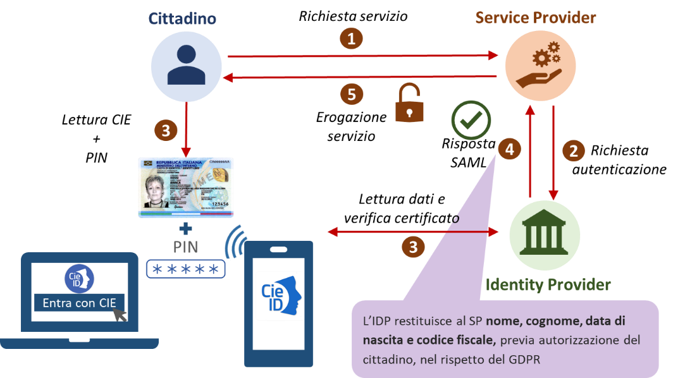
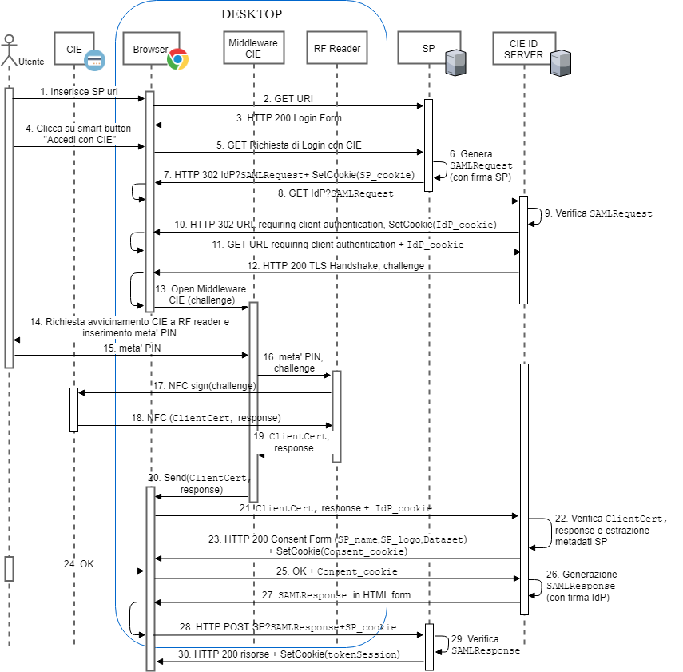
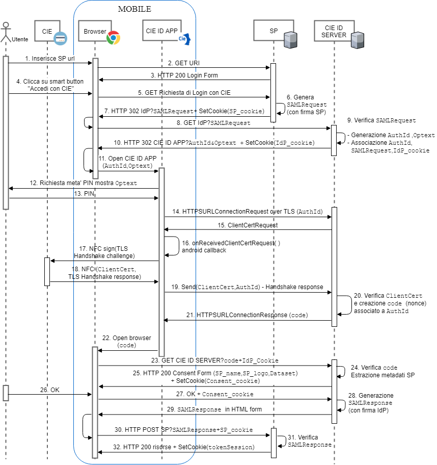
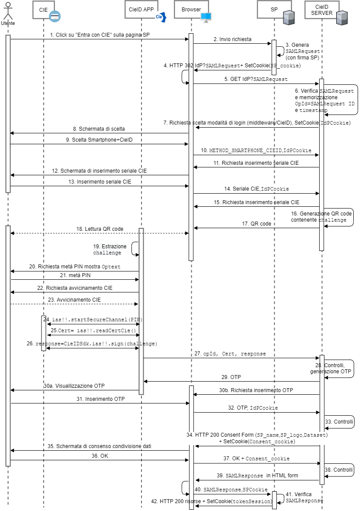

==============================
Soluzione eID basata sulla CIE 
==============================

Lo schema di autenticazione Entra con CIE é di tipo Single Sign-On (SSO) federato e dunque prevede l'introduzione di un gestore dell'identitá dell'utente, un Identity Provider (IdP), al quale i fornitori di servizi online, Service Provider (SP), richiedono, previa federazione, la verifica dell'identitá dell'utente. 
In particolare lo schema Entra con CIE prevede l'istituzione di un IdP unico, il Ministero dell'Interno, che in qualitá di ente responsabile dell'emissione della CIE, ne cura anche gli aspetti legati all'impiego documento come strumento di identitá digitale. Di seguito viene mostrato uno schema logico della soluzione eID basata sulla CIE. 

   Schema di autenticazione Entra con CIE.

L'accesso per il tramite della CIE ai servizi erogati in rete dalle PP.AA. è reso possibile mediante il Server CieID, un server SAML 2.0 posto presso il Ministero dell'Interno e fruibile attraverso Internet e o SPC. Tale componente server, sviluppato e gestito dal Poligrafico e Zecca dello Stato S.p.A. (PZS) che riveste il ruolo di partner tecnologico del Ministero dell'Interno, svolge le seguenti funzioni:

   - Effettua l'identificazione informatica dell'utente;
   
   - Verifica la validità del certificato a bordo della CIE;

   - Ottempera all'obbligo di visualizzazione dei dati che saranno trasmessi all'erogatore di servizio;
   
   - Invia una asserzione di autenticazione sigillata con sigillo riconducibile al Ministero dell'Interno all'erogatore del servizio; tale asserzione costituisce prova di avvenuto riconoscimento dell'utente da parte di CieID Server e del Ministero stesso. 

.. note::
   L'interazione con l'utente da parte della componente CieID Server, puó avvenire secondo diverse modalitá 

   - **Modalitá "desktop"**: l'utente avvia la richiesta del servizio tramite un browser installato sul proprio computer ed effettua l'autenticazione richiesta dall'IdP usando un lettore *contactless* collegato al computer 

   - **Modalitá "mobile"**: l'utente avvia la richiesta del servizio tramite un browser installato su un dispositivo mobile (smartphone o tablet) dotato di interfaccia NFC e completa la fase di autenticazione avvicinando la CIE al proprio dispositivo;

   - **Modalitá "computer + smartphone"**: l'utente avvia la richiesta del servizio tramite un browser installato sul proprio computer ed effettua l'autenticazione avvicinando la CIE al proprio dispositivo mobile dotato di interfaccia NFC

   Schema di autenticazione Entra con CIE tramite modalitá "desktop".

   Schema di autenticazione Entra con CIE tramite modalitá "mobile".

   Schema di autenticazione Entra con CIE tramite modalitá "computer + smartphone".

Lo schema Entra con CIE si realizza mediante due macro fasi distinte: 

   1. richiesta del servizio esposto dal portale/app del Service Provider che avviene all'interno del browser dell'utente nel dominio del SP;

   2. autenticazione dell'utente effettuata direttamente dall'Identity Provider.

Per quanto concerne il primo punto, la richiesta avviene tramite una "*call to action*" realizzata dal Service Provider tramite un apposito pulsante "Entra con CIE" e che ha come *landing page* un *endpoint* del Ministero dell'Interno il quale innesca il processo di identificazione mediante la componente server CieID dell'IdP. Per consentire una esperienza utente quanto più possibile omogenea presso tutti i service provider che integrano lo schema di identificazione mediante la CIE si deve utilizzare il kit disponibile all'indirizzo https://github.com/italia/cie-graphics.

   Pulsante ufficiale "Entra con CIE"

In riferimento al secondo punto, invece, l'autenticazione dell'utente é avviata dall'Identity Provider che richiede la lettura della CIE e in particolare l'invio del certificato digitale X.509 di autenticazione presente nel chip del documento e protetto dal codice PIN. La comunicazione a basso livello con la carta varia a seconda delle modalitá di utilizzo. 
Nel caso di modalitá "desktop" é possibile scaricare e installare un appposito software denominato CieID (Middleware) disponibile per i Sistemi operativi Windows, MacOS e Linux all'indirizzo https://www.cartaidentita.interno.gov.it/software-cie, che consente l'integrazione della CIE all'interno del sistema operativo ospite quale token crittografico esterno.
Nel caso di autenticazione effettuata tramite un dispositivo mobile, é possibile scaricare gratuitamente e installare l'App "CieID" direttamente dallo Store online (`Android <https://play.google.com/store/apps/details?id=it.ipzs.cieid>`__ o `iOS <https://apps.apple.com/it/app/cieid/id1504644677>`__). 

   App CieID Android - Link per il download

   App CieID iOS - Link per il download

Allo stato dell'arte questa modalitá è fruibile mediante smartphone dotati di tecnologia NFC e sistema operativo Android 6 o superiore, mediante il browser “Chrome”, e iPhone 7 o superiori con sistemi operativi iOS 13 o superiore [#]_ , mediante browser Safari. Tutte le componenti software, sia lato server IdP e sia client (Middleware e App CieID), sono sviluppate e gestite dal Poligrafico che cura anche le attività di supporto e assistenza tecnica al Service Provider nell'utilizzo di tali strumenti e durante l'intero iter di integrazione dello schema "Entra con CIE" all'interno dei servizi erogati dai SP.

.. note::

   Ai fini di sviluppo, per effettuare i test in ambiente di pre-produzione e di produzione disponibili presso il Ministero dell'Interno, é possibile utilizzare il software CieID disponibile per computer, secondo lo scenario "desktop" appena presentato. Per i test in modalitá "mobile" o "computer + smartphone",  non é possibile, invece, usare l'App CieID "ufficiale" in ambiente di pre-produzione ma é necessario installare l'App CieID di test [#]_ disponibile al seguente `link <https://install.appcenter.ms/users/ipzsapp/apps/cieid-preproduzione/distribution_groups/public%20link>`__ . 

   .. figure:: ./media/AppCieID-Test-QR.png
      :alt: AppCieID-Test-QR
      :scale: 70 %
      :name: AppCieID-Test-QR

      App CieID di test - Link per il download
   
   
   Per effettuare i test in pre-produzione tramite l'App CieID di test o mediante il software CieID e agevolare gli sviluppi applicativi, é possibile usare, in caso di indisponibilitá di una CIE "autentica", le carte di test che é possibile richiedere in fase di onboarding tramite il `portale di federazione erogatori di sevizi <https://federazione.servizicie.interno.gov.it>`__  (cfr. il `Manuale operativo per i fornitori di servizi pubblici e privati <https://docs.italia.it/italia/cie/cie-manuale-operativo-docs>`__ per ulteriori dettagli sul processo di onboarding).  

Per i Service Provider interessati a fornire al cittadino i propri servizi online tramite una App proprietaria, ci sono due modalitá di integrazione: 

   - Flusso con reindirizzamento: l'App del Service Provider, all'atto della richiesta di autenticazione dell'utente, reindirizza la richiesta all'App CieID che gestisce direttamente l'autenticazione con la CIE. 

   - Flusso integrato: il processo di autenticazione viene effettuato direttamente in maniera nativa all'interno dell'App del Service Provider, il quale integra la comunicazione con la CIE mediante una libreria software rilasciata e gestita dal Poligrafico. 

Agli indirizzi https://github.com/italia/cieid-android-sdk e https://github.com/italia/cieid-ios-sdk, sono disponibili gratuitamente le SDK Android e iOS che mettono a disposizione esempi di codice sorgente per l'integrazione dei due flussi sopra riportati nonché una libreria software per l'integrazione del flusso integrato con esempi. 

Indipendentemente dalla modalitá di realizzazione della fase di autenticazione, per realizzare lo schema Entra con CIE é necessario che il Service Provider effettui i seguenti passi operativi:

1. predisposizione dei metadata necessari per la fase di federazione (cfr. :ref:`federazione`);

2. implementazione dei protocolli SAML di comunicazione con l'IdP per gestire correttamente le fasi di Single Sign-On e di Logout (cfr. :ref:`protocolli` e :ref:`binding`);

3. verifica e validazione della corretta implementazione del servizio di autenticazione (cfr. :ref:`testing`).

Nei paragrafi successivo verranno descritte nel dettaglio le fasi operative appena riportate.

.. [#] Non è consentito l'accesso da terminali dotati di sistema operativo iOS precedenti alla release 13 a causa dell'impossibilità di impiego del lettore NFC per contesti di utilizzo non approvati da Apple.

.. [#] L'App CieID di test é attualmente disponibile solo per dispositivi Android.

 