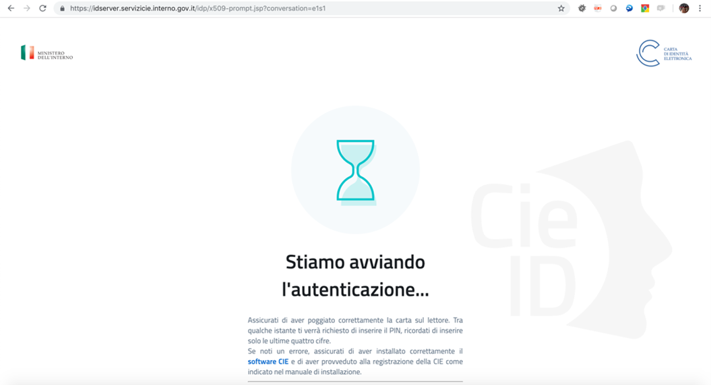

.. _protocolli:

===========================
Protocolli di comunicazione
===========================

.. role:: xml(code)
  :language: xml

Terminata la fase di federazione tramite lo scambio dei metadata opportunamente predisposti come da specifiche riportate nella precedente sezione, il Service Provider viene aggiunto nella *trusted list* dell'Identity Provider ed é quindi possibile lo scambio dei messaggi previsto dal protocollo SAML SSO. Tale protocollo viene avviato al momento in cui l'utente esprime la volontà di accedere al servizio cliccando il tasto "Entra con CIE" nella pagina html del Service Provider. Quest'ultimo prepara di conseguenza una richiesta di autenticazione (:xml:`<AuthnRequest>`) che inoltra all'Identity Provider al quale l'utente viene reindirizzato per effettuare l'autenticazione tramite la propria CIE. La componente server dell'Identity Provider (CieID Server) invita l'utente a avvicinare la propria CIE sul lettore avviando automaticamente il processo di autenticazione mediante la CIE. L'utente deve, quindi, inserire la seconda metà del PIN e confermare. 

   Processo di autenticazione del CieID Server

Terminato il processo di autenticazione il server CieID mostra una pagina contenente gli attributi desunti dal certificato digitale a bordo della carta. L'utente, informato degli attributi che si stanno per inviare al servizio, prosegue con l'operazione e viene reindirizzato nuovamente sul sito del Service Provider, con un'asserzione (:xml:`<Response>`) firmata dall'Identity Provider contenente gli attributi richiesti (nome, cognome, data di nascita e codice fiscale).

.. note::

    All'interno dello schema Entra con CIE solo il *Single Sign-On* viene gestisto tramite protocollo SAML che prevede di tue tipologie di messaggi:

    - Richiesta di autenticazione: :xml:`<AuthnRequest>`;
    - Risposta di autenticazione: :xml:`<Response>`.

    La gestione del logout, attualmente, non supporta il procollo SAML, ma viene gestite mediante un meccanismo di *Simple Logout* che provvede all'eliminazione della sessione di autenticazione dell'Identity Provider. Pertanto, pur accettando le richieste SAML di *Single Logout*, l'IdP server CieID non restituisce alcuna risposta SAML.  

Richiesta di autenticazione SAML
################################

La richiesta di autenticazione ("*request*") è inviata dal Service Provider attraverso il browser dell'utente al *SingleSignOnService* dell'Identity Provider. Il messaggio contenuto in essa deve essere conforme allo standard SAML v2.0 (cfr. `Assertions and Protocols for the OASIS SAML V2.0 <https://docs.oasis-open.org/security/saml/v2.0/saml-core-2.0-os.pdf>`__). 

L'elemento :xml:`<AuthnRequest>` costituisce il contenitore del messaggio e deve avere i seguenti attributi:

    - :xml:`Destination` rappresenta un URL in https che indica l'indirizzo dell'Identity Provider a cui è inviata la richiesta e deve coincidere con uno degli attributi :xml:`Location` presenti nel tag :xml:`SingleSignOnService` riportato nel metadata dell'IdP e relativo al particolare binding utilizzato in fase di richiesta (cfr. :ref:`binding` per ulteriori dettagli).  L'Identity Provider verifica tale riferimento e, in caso di esito negativo, la richiesta viene scartata.
    - :xml:`AttributeConsumingServiceIndex` riportante un indice posizionale in riferimento alla struttura :xml:`<AttributeConsumingService>` presente nei metadata del Service Provider. A tal proposito si ricorda che gli attributi richiesti nel metadata **devono** contenere il *Minimum Dataset eIDAS*.
    - :xml:`AssertionConsumerServiceURL` indica la URL a cui inviare il messaggio di risposta alla richiesta di autenticazione (l'indirizzo deve coincidere con quello del servizio riportato dall'elemento :xml:`<AssertionConsumingService>` presente nei metadata del Service Provider);
    - :xml:`ProtocolBinding` identifica il tipo di binding e **deve** essere valorizzato con :code:`urn:oasis:names:tc:SAML:2.0:bindings:HTTP-POST`.
    - :xml:`ForceAuthn` è **sempre** valorizzato con :code:`true` in quanto si richiede un'autenticazione con massimo livello di sicurezza.
    - :xml:`IssueInstant` indica l'istante di emissione della richiesta, in formato UTC (p.es. :code:`AAAA-MM-GGThh:mm:ss.sssZ`)
    - :xml:`ID` univoco basato su un Universally Unique Identifier (**UUID**) o su una combinazione origine + timestamp (quest'ultimo generato con una precisione di almeno un millesimo di secondo per garantire l'univocità).
    - :xml:`Version` coerentemente con la versione di SAML adottata; attualmente la :code:`2.0`.

.. note::
    - **In alternativa**, è ammesso l'uso dell'attributo :xml:`AssertionConsumerServiceIndex` al posto degli attributi :xml:`AssertionConsumerServiceURL` e :xml:`ProtocolBinding`.
    - L'attributo :xml:`IsPassive` **non** deve essere presente.
    - L'attributo :xml:`Destination` **deve** essere valorizzato in accordo con lo standard SAML e **non** secondo quanto prescitto dalle Regole Tecniche SPID.

.. code-block:: xml
    :linenos:

    <samlp:AuthnRequest
      xmlns:samlp="urn:oasis:names:tc:SAML:2.0:protocol"
      AttributeConsumingServiceIndex="0"
      AssertionConsumerServiceIndex="0"
      Destination="https://idserver.servizicie.interno.gov.it/idp/profile/SAML2/Redirect/SSO"
      ForceAuthn="true"
      IssueInstant="2020-10-29T12:51:36.123Z"
      ID="..."
      Version="2.0">
        [...]
    </samlp:AuthnRequest>

Gli elementi che devono essere presenti all'interno della :xml:`<AuthnRequest>` sono:

    - :xml:`<saml:Issuer>`: identifica in maniera univoca il Service Provider. L'elemento deve essere valorizzato come l'attributo :xml:`entityID` riportato nel corrispondente metadata del Service Provider. Prevede, inoltre, i seguenti attributi opzionali: 
    - :xml:`NameQualifier`, dominio a cui afferisce il soggetto che sta effettuando la richiesta di autenticazione e valorizzato come URL riconducibile al Service Provider;
    - :xml:`Format`, se presente **deve** essere valorizzato con la stringa :code:`urn:oasis:names:tc:SAML:2.0:nameid-format:entity`.

- :xml:`<NameIDPolicy>` avente l'attributo :xml:`Format` valorizzato con la stringa :code:`urn:oasis:names:tc:SAML:2.0:nameid-format:transient`, mentre invece **non deve** essere presente l'attributo :xml:`AllowCreate`. 
- :xml:`<RequestedAuthnContext>` (ne è presente **una sola** occorrenza) specifica i requisiti del contesto di autenticazione di statement di autenticazione restituite in risposta a una richiesta. Esso è valorizzato come segue:

    - mediante l'attributo :xml:`Comparison`, che specifica il metodo di confronto utilizzato per valutare le classi o gli statement di contesto richiesti e può essere valorizzato soltanto come :code:`exact` (default), ovvero :code:`minimum`;
    - contenente l'elemento :xml:`<RequestedAuthnContext>`, contiene a sua volta l'elemento :xml:`<saml:AuthnContextClassRef>`, valorizzato con uno dei seguenti valori:

        - :code:`https://www.spid.gov.it/SpidL1`
        - :code:`https://www.spid.gov.it/SpidL2`
        - :code:`https://www.spid.gov.it/SpidL3`
        
Lo schema di autenticazione "*Entra con CIE*", nell'ottica di agevolare gli sviluppi implementativi da parte dei Service Provider che giá hanno aderito al Sistema Pubblico di Identità Digitale (*SPID*), richiede la valorizzazione di tale elemento con una delle suddette stringhe (corrispondenti ai tre livelli di affidabilità dello SPID), sebbene il livello di affidabilità dello schema CIE è sempre analogo al quello massimo previsto per tutti gli schemi di identificazione elettronica a livello europeo (analogo anche al Livello 3 di SPID).
Pertanto, per consentire al cittadino di autenticarsi sia a servizi accessibili tramite CIE, che a quelli accessibili tramite qualunque livello di sicurezza SPID, le possibili combinazioni di valori dell'elemento :xml:`<RequestedAuthnContextClassRef>` e dell'attributo-antenato :xml:`Comparison` sono, rispettivamente:

- autenticazione con CIE ovvero con SPID di Livello 3: :code:`https://www.spid.gov.it/SpidL3` e, equivalentemente, :code:`exact` ovvero :code:`minimum`;
- autenticazione con CIE ovvero con SPID di Livelli 2 o 3: :code:`https://www.spid.gov.it/SpidL2` e :code:`minimum`;
- autenticazione con CIE ovvero con SPID (qualunque Livello): :code:`https://www.spid.gov.it/SpidL1` e :code:`minimum`;

.. note::

    - Dipendentemente dal tipo di binding utilizzato per inviare la richiesta di autenticazione può essere presente o meno l'elemento :xml:`<Signature>` (**obbligatorio** in caso di binding HTTP POST), che contiene il sigillo elettronico creato dal Service Provider sulla propia *request*. Per maggiori dettagli, si veda il capitolo relativo all':ref:`infrastruttura a chiave pubblica <pki>`.
    - Non sono presenti gli elementi :xml:`<RequesterID>` e :xml:`<Scoping>`.

Esempio di *request* SAML
-------------------------
Si noti che l'elemento XML :xml:`<Signature>` nel seguente esempio va inserito solo nel caso di utilizzo del binding HTTP POST; in caso di binding HTTP Redirect, il sigillo elettronico è immerso invece nel parametro :code:`Signature` della *query string*. Per ulteriori informazioni si faccia riferimento al capitolo sull':ref:`infrastruttura a chiave pubblica <pki>`.

.. code-block:: xml
    :linenos:
    
    <samlp:AuthnRequest 
      xmlns:samlp="urn:oasis:names:tc:SAML:2.0:protocol"
      xmlns:saml="urn:oasis:names:tc:SAML:2.0:assertion" 
      xmlns:ds="http://www.w3.org/2000/09/xmldsig#" 
      AttributeConsumingServiceIndex="0" 
      AssertionConsumerServiceURL=" [...] " 
      ProtocolBinding="urn:oasis:names:tc:SAML:2.0:bindings:HTTP-POST" 
      Destination="https://idserver.servizicie.interno.gov.it/idp/profile/SAML2/POST/SSO"
      ForceAuthn="true" 
      ID="..." 
      IssueInstant="2020-11-02T09:01:25Z" Version="2.0">
        <saml:Issuer NameQualifier="https://service_provide_entityID">
            https://service_provider_entityID
        </saml:Issuer>
        <ds:Signature>
            <ds:SignedInfo>
                <ds:CanonicalizationMethod Algorithm="http://www.w3.org/2001/10/xml-exc-c14n#" />
                <ds:SignatureMethod Algorithm="http://www.w3.org/2001/04/xmldsig-more#rsa-sha256" />
                <ds:Reference URI="RIFERIMENTO ALL'ID DELL'ATTRIBUTO">
                    <ds:Transforms>
                        <ds:Transform Algorithm="http://www.w3.org/2000/09/xmldsig#enveloped-signature" />
                        <ds:Transform Algorithm="http://www.w3.org/2001/10/xml-exc-c14n#" />
                    </ds:Transforms>
                    <ds:DigestMethod Algorithm="http://www.w3.org/2001/04/xmlenc#sha256" />
                    <ds:DigestValue> [...] </ds:DigestValue>
                </ds:Reference>
            </ds:SignedInfo>
            <ds:SignatureValue> [...] </ds:SignatureValue>
            <ds:KeyInfo>
                <ds:X509Data>
                    <ds:X509Certificate> [...] </ds:X509Certificate>
                </ds:X509Data>
            </ds:KeyInfo>
        </ds:Signature>
        <samlp:NameIDPolicy Format="urn:oasis:names:tc:SAML:2.0:nameid-format:transient" />
        <samlp:RequestedAuthnContext Comparison="minimum">
            <saml:AuthnContextClassRef>https://www.spid.gov.it/SpidL3</saml:AuthnContextClassRef>
        </samlp:RequestedAuthnContext>
    </samlp:AuthnRequest>

    
Risposta di autenticazione SAML
###############################

Al termine della *challenge* mediante la CIE, effettuata dal server CieID dell'Identity Provider, quest'ultimo invia un messaggio di risposta ("*response*") al Service Provider. L'elemento :xml:`<Response>` costituisce la radice del messaggio e contiene i seguenti attributi:

- :xml:`Destination`: URL del Service Provider a cui è inviata la risposta; coincide con la URL riportata nel metadata cosí come specificato dall'attributo :xml:`location` presente nell'elemento :xml:`<AssertionConsumerService>`. Il Service Provider deve verificare il riferimento URI e, in caso di esito negativo, deve scartare la risposta;
- :xml:`ID`: identificatore univoco basato su un Universally Unique Identifier (**UUID**) o su una combinazione origine + *timestamp* (quest'ultimo generato con una precisione di almeno un millesimo di secondo per garantire l'univocità);
- :xml:`InResponseTo`: riferimento all'ID della richiesta a cui si risponde;
- :xml:`IssueInstant`: indica l'istante di emissione della richiesta, in formato UTC (:code:`AAAA-MM-GGThh:mm:ss.sssZ`);
- :xml:`Version`: riferimento alla versione SAML (2.0) utilizzata dallo schema Entra con CIE.

Gli elementi contenuti nella :xml:`<Response>` (tutti dichiarati con il corretto uso dei *namespace* XML) sono:

- :xml:`<Issuer>`: in maniera analoga a quanto previsto per la *request*, tale campo indica l'EntityID del soggetto che effettua l'autenticazione (cioè l'Identity Provider stesso) e coincide perciò con l'attributo :xml:`entityID` del metadata dell'IdP.
- :xml:`<Signature>`: contiene il sigillo elettronico apposto sulla *request* dell'Identity Provider. Per ulteriori informazioni si faccia riferimento al capitolo sull':ref:`infrastruttura a chiave pubblica <pki>`.
- :xml:`<Status>`: indica l'esito della richiesta di autenticazione e in particolare prevede l'elemento :xml:`<StatusCode>` che riporta la codifica di stato SAML attraverso l'attributo :xml:`Value`, valorizzato come:

    - :code:`urn:oasis:names:tc:SAML:2.0:status:Success`, nel caso di autenticazione effettuata con successo;
    - in caso di errori, é possibile visualizzare gli attributi :xml:`<StatusMessage>` e :xml:`<StatusDetail>` per maggiori dettagli sull'errore ricevuto.

- :xml:`<Assertion>`: costituisce l'elemento piú importante che attesta l'avvenuta autenticazione e contiene gli attributi dell'utente che ha richiesto l'accesso al servizio. Contiene almeno un elemento :xml:`<AuthnStatement>` nel quale sono riportati i dati dell'utente richiesti dal Service Provider. Nel caso l'Identity Provider abbia riscontrato un errore nella gestione della richiesta di autenticazione l'elemento :xml:`<Assertion>` non é presente.

Esempio di *response* SAML
--------------------------

.. code-block:: xml
    :linenos:

    <samlp:Response 
      xmlns:samlp="urn:oasis:names:tc:SAML:2.0:protocol"
      xmlns:saml="urn:oasis:names:tc:SAML:2.0:assertion"
      Destination="https://service_provide_assertion_consumer" 
      InResponseTo="..." 
      IssueInstant="2020-10-29T11:36:02.708Z" 
      ID="..." 
      Version="2.0">
        <saml:Issuer>
            https://idserver.servizicie.interno.gov.it/idp/profile/SAML2/POST/SSO
        </saml:Issuer>
        <ds:Signature xmlns:ds="http://www.w3.org/2000/09/xmldsig#">
            [...]
        </ds:Signature>
        <samlp:Status>
            <samlp:StatusCode Value="urn:oasis:names:tc:SAML:2.0:status:Success" />
        </samlp:Status>
        <saml:Assertion> 
            [...] 
        </saml:Assertion>
    </samlp:Response>

L'elemento :xml:`<saml:Assertion>`
----------------------------------

Nell'elemento :xml:`<Assertion>` devono essere presenti i seguenti attributi:
    
    - :xml:`ID`: identificatore univoco basato su un *Universally Unique Identifier* (**UUID**) o su una combinazione origine + *timestamp* (quest'ultimo generato con una precisione di almeno un millesimo di secondo per garantire l'univocità);
    - :xml:`IssueInstant`: indica l'istante di emissione della richiesta, in formato UTC (:code:`AAAA-MM-GGThh:mm:ss.sssZ`);
    - :xml:`Version`: riferimento alla versione SAML (:code:`2.0`) utilizzata dallo schema *Entra con CIE*.

Gli attributi contenuti nella :xml:`<Assertion>` sono i seguenti:

    - :xml:`<Issuer>`: valorizzato coerentemente con l'*EntityID* (attributo :xml:`entityID`) presente nei corrispondenti metadata dell'Identity Provider.
    - :xml:`<Signature>`: contiene il sigillo elettronico apposto sull'asserzione dell'Identity Provider. Per ulteriori informazioni si faccia riferimento al capitolo sull':ref:`infrastruttura a chiave pubblica <pki>`.
    - :xml:`<Subject>`: serve a qualificare il Service Provider che ha richiesto l'autenticazione. In particolare, contiene due elementi:

        - :xml:`<NameID>`: riferimento all'identificativo del SP e contenente principalmente le informazioni che qulificano l'IdP (:xml:`NameQualifier`) e il SP (:xml:`SPNameQualifier`)
        - :xml:`<SubjectConfirmation>`: riporta l'attributo :xml:`Method` valorizzato con la stringa :code:`urn:oasis:names:tc:SAML:2.0:cm:bearer`. Tale elemento contiene inoltre l'elemento :xml:`<SubjectConfirmationData>` riportante gli attributi:

            - :xml:`Recipient` coerente con l':xml:`AssertionConsumerServiceURL` relativa al servizio per cui è stata emessa l'asserzione e l'attributo;
            - :xml:`NotOnOrAfter` indica per quanto tempo l'asserzione puó ritenersi legata al *subject*. L'asserzione puó, tuttavia, essere valida per un tempo piú lungo, ma é necessario creare una sessione entro questo intervallo di tempo (per maggiori dettagli consultare la sezione 4.1.4.3. del Profilo Web SSO). Tale intervallo di tempo deve rientrare necessariamente nell'intervallo di tempo riportato nell'elemento :xml:`<Conditions>`;
            - :xml:`InResponseTo` il cui valore deve fare riferimento all'ID della richiesta;
            - :xml:`Address`, facoltativamente presente, contiene un identificativo univoco (ma non riconducibile a informazioni tecnico-implementative) dello specifico server CieID che ha tecnicamente effettuato l'autenticazione;

    - :xml:`<Conditions>`:  contenente gli attributi :xml:`NotBefore` e :xml:`NotOnOrAfter` che rappresentano le condizioni di validitá dell'asserzione. Inoltre é presente l'elemento :xml:`<AudienceRestriction>` riportante a sua volta l'elemento :xml:`<Audience>`, valorizzato con l'*EntityID* del Service Provider per il quale l'asserzione è emessa.
    - :xml:`<AuthnStatement>`: oltre alle informazioni riguardanti il riferimento alla sessione (:xml:`SessionIndex`), l'istante temporale di autenticazione dell'utente (:xml:`AuthnInstant`). Contiene a sua volta  l'elemento :xml:`AuthnContext` e il sotto-elemento :xml:`<AuthnContextClassRef>` valorizzato con il livello di affidabilità associato all'autenticazione con CIE.
    - :xml:`<AttributeStatement>`: rappresenta la struttura nella quale sono riportati gli attributi relativi all'utente, così come richiesti dell'omologo elemento della *request* SAML.

In particolare, a fronte della richiesta del *eIDAS Minimum Data Set* l'asserzione contiene quattro elementi di tipo :xml:`<Attribute>` (ciascuno contenente l'attributo :xml:`Name` valorizzato come segue e l'attributo :xml:`NameFormat` valorizzato con :code:`urn:oasis:names:tc:SAML:2.0:attrname-forma`):

    - :code:`name` (di tipo :xml:`xs:string`), valorizzato con il **nome** del soggetto;
    - :code:`familyName` (di tipo :xml:`xs:string`), valorizzato con il **cognome** del soggetto;
    - :code:`dateOfBirth` (di tipo :xml:`xs:string`) **data di nascita** nel formato :code:`YYYY-MM-GG`;
    - :code:`fiscalNumber` (di tipo :xml:`xs:string`), valorizzato con il **codice fiscale** nel formato :code:`TINIT-<CODICE FISCALE>`.

.. note::

   L'elemento :xml:`<AuthnContextClassRef>` discendente dell'elemento :xml:`<AuthnStatement>` è **sempre** valorizzato con :code:`https://www.spid.gov.it/SpidL3` poiché la CIE fornisce un livello di affidabilità massimo a livello europeo, corispondente al Livello 3 del Sitema Pubblico dell'Identità Digitale (*SPID*). Per favorire l'interoperabilitá con SPID da parte dei Service Provider e minimizzare quindi l'impatto nella gestione implementativa delle risposte SAML per i SP che intendono aderere ad entrambi gli schemi di autenticazione, si restituisce dunque una classe analoa a quella usata dagli Identity Provider SPID nelle *response* associate ad autenticazioni avvenute con Livello 3. 

.. code-block::
    :linenos:

    <saml:Assertion
      xmlns:saml="urn:oasis:names:tc:SAML:2.0:assertion"
      xmlns:xs="http://www.w3.org/2001/XMLSchema"
      xmlns:xsi="http://www.w3.org/2001/XMLSchema-instance" 
      IssueInstant="2020-11-03T09:19:36.785Z" 
      ID="..." 
      Version="2.0">
        <saml:Issuer>
            https://idserver.servizicie.interno.gov.it/idp/profile/SAML2/POST/SSO
        </saml:Issuer>
        <ds:Signature xmlns:ds="http://www.w3.org/2000/09/xmldsig#">
            [...]
        </ds:Signature>
        <saml:Subject>
            <saml:NameID 
              Format="urn:oasis:names:tc:SAML:2.0:nameid-format:transient" 
              NameQualifier="https://idserver.servizicie.interno.gov.it/idp/profile/SAML2/POST/SSO">
                RIFERIMENTO ID ENTE
            </saml:NameID>
            <saml:SubjectConfirmation Method="urn:oasis:names:tc:SAML:2.0:cm:bearer">
                <saml:SubjectConfirmationData 
                  InResponseTo="..." 
                  NotOnOrAfter="2020-11-03T09:24:36.807Z" 
                  Recipient="https://service_provider_assertion_consumer" />
            </saml:SubjectConfirmation>
        </saml:Subject>
        <saml:Conditions 
          NotBefore="2020-11-03T09:19:36.785Z" 
          NotOnOrAfter="2020-11-03T09:24:36.785Z">
            <saml:AudienceRestriction>
                <saml:Audience>https://sevice_provider</saml:Audience>
            </saml:AudienceRestriction>
        </saml:Conditions>
        <saml:AuthnStatement 
          AuthnInstant="2020-11-03T09:19:33.100Z" 
          SessionIndex="....">
            <saml:AuthnContext>
                <saml:AuthnContextClassRef>https://www.spid.gov.it/SpidL3</saml:AuthnContextClassRef>
            </saml:AuthnContext>
        </saml:AuthnStatement>
        <saml:AttributeStatement>
            <saml:Attribute FriendlyName="Data di Nascita" Name="dateOfBirth" NameFormat="urn:oasis:names:tc:SAML:2.0:attrname-format:basic">
                <saml:AttributeValue xsi:type="xs:string">AAAA-MM-GG</saml:AttributeValue>
            </saml:Attribute>
            <saml:Attribute FriendlyName="Codice Fiscale" Name="fiscalNumber" NameFormat="urn:oasis:names:tc:SAML:2.0:attrname-format:basic">
                <saml:AttributeValue xsi:type="xs:string">TINIT-CODICE_FISCALE</saml:AttributeValue>
            </saml:Attribute>
            <saml:Attribute FriendlyName="Nome" Name="name" NameFormat="urn:oasis:names:tc:SAML:2.0:attrname-format:basic">
                <saml:AttributeValue xsi:type="xs:string">NOME</saml:AttributeValue>
            </saml:Attribute>
            <saml:Attribute FriendlyName="Cognome" Name="familyName" NameFormat="urn:oasis:names:tc:SAML:2.0:attrname-format:basic">
                <saml:AttributeValue xsi:type="xs:string">COGNOME</saml:AttributeValue>
            </saml:Attribute>
        </saml:AttributeStatement>
    </saml:Assertion>

.. note::

    Con riferimento alla compatibilità con SPID si riporta quanto segue:

    - L'attributo :xml:`Format` dell'elemento :xml:`<samlp:Issuer>` non è presente;
    - L'elemento :xml:`<saml:AuthnContextClassRef>` è valorizzato sempre con il valore **https://www.spid.gov.it/SpidL3**;
    - Gli attributi inviati in risposta alla richiesta di autenticazione corrispondono sempre al **Minimum Dataset eIDAS** e non prevedono, nella versione attuale, l'invio di ulteriori attributi quali ad esempio lo *spidCode*. 

Verifica della :xml:`<Response>`
--------------------------------

Alla ricezione della :xml:`<Response>` qualunque sia il binding utilizzato il Service Provider prima di utilizzare l'asserzione deve eseguire le seguenti verifiche:

    - Controllo delle firme presenti all'interno dell':xml:`<Assertion>` e della :xml:`<Response>`
    - Verifica che nell'elemento :xml:`<SubjectConfirmationData>`
     
        - l'attributo :xml:`Recipient` coincida con la AssertionConsumerServiceURL a cui la :xml:`<Response>` è pervenuta
        - l'attributo :xml:`NotOnOrAfter`  non sia scaduto
        - l'attributo :xml:`InResponseTo`  si riferisca correttamente all'ID della :xml:`<AuthnRequest>` di richiesta
        
.. note::
    É, inoltre, a carico del Service Provider garantire che le asserzioni non vengano ripresentate, mantenendo il set di identificatori di richiesta (ID) usati come per le :xml:`<AuthnRequest>` per tutta la durata di tempo per cui l'asserzione risulta essere valida in base dell'attributo :xml:`NotOnOrAfter` dell'elemento :xml:`<SubjectConfirmationData>` presente nell'asserzione stessa.

Esempio di :xml:`<saml:Response>`
---------------------------------

Di seguito si riporta un esempio completo di :xml:`<saml:Response>`:
    
.. code-block:: xml
    :linenos:

    <samlp:Response 
      xmlns:samlp="urn:oasis:names:tc:SAML:2.0:protocol"
      xmlns:saml="urn:oasis:names:tc:SAML:2.0:assertion"
      xmlns:ds="http://www.w3.org/2000/09/xmldsig#"
      xmlns:xs="http://www.w3.org/2001/XMLSchema"
      xmlns:xsi="http://www.w3.org/2001/XMLSchema-instance" 
      Destination="https://service_provide_assertion_consumer" 
      ID="..." 
      InResponseTo="..." 
      IssueInstant="2020-10-29T11:36:02.708Z" Version="2.0">
        <saml:Issuer>
            https://idserver.servizicie.interno.gov.it/idp/profile/SAML2/POST/SSO
        </saml:Issuer>
        <ds:Signature>
            <ds:SignedInfo>
                <ds:CanonicalizationMethod Algorithm="http://www.w3.org/2001/10/xml-exc-c14n#" />
                <ds:SignatureMethod Algorithm="http://www.w3.org/2001/04/xmldsig-more#rsa-sha256" />
                <ds:Reference URI="...">
                    <ds:Transforms>
                        <ds:Transform Algorithm="http://www.w3.org/2000/09/xmldsig#enveloped-signature" />
                        <ds:Transform Algorithm="http://www.w3.org/2001/10/xml-exc-c14n#" />
                    </ds:Transforms>
                    <ds:DigestMethod Algorithm="http://www.w3.org/2001/04/xmlenc#sha256" />
                    <ds:DigestValue> [...] </ds:DigestValue>
                </ds:Reference>
            </ds:SignedInfo>
            <ds:SignatureValue> [...] </ds:SignatureValue>
            <ds:KeyInfo>
                <ds:X509Data>
                    <ds:X509Certificate> [...] </ds:X509Certificate>
                </ds:X509Data>
            </ds:KeyInfo>
        </ds:Signature>
        <samlp:Status>
            <samlp:StatusCode Value="urn:oasis:names:tc:SAML:2.0:status:Success" />
        </samlp:Status>
        
        <saml:Assertion 
          ID="..." 
          IssueInstant="2020-11-03T09:19:36.785Z" 
          Version="2.0">
            <saml:Issuer Format="urn:oasis:names:tc:SAML:2.0:nameid-format:entity">
                https://idserver.servizicie.interno.gov.it/idp/profile/SAML2/POST/SSO
            </saml:Issuer>
            <ds:Signature>
                <ds:SignedInfo>
                    <ds:CanonicalizationMethod Algorithm="http://www.w3.org/2001/10/xml-exc-c14n#" />
                    <ds:SignatureMethod Algorithm="http://www.w3.org/2001/04/xmldsig-more#rsa-sha256" />
                    <ds:Reference URI="...">
                        <ds:Transforms>
                            <ds:Transform Algorithm="http://www.w3.org/2000/09/xmldsig#enveloped-signature" />
                            <ds:Transform Algorithm="http://www.w3.org/2001/10/xml-exc-c14n#" />
                        </ds:Transforms>
                        <ds:DigestMethod Algorithm="http://www.w3.org/2001/04/xmlenc#sha256" />
                        <ds:DigestValue> [...] </ds:DigestValue>
                    </ds:Reference>
                </ds:SignedInfo>
                <ds:SignatureValue> [...] </ds:SignatureValue>
                <ds:KeyInfo>
                    <ds:X509Data>
                        <ds:X509Certificate> [...] </ds:X509Certificate>
                    </ds:X509Data>
                </ds:KeyInfo>
            </ds:Signature>
            <saml:Subject>
                <saml:NameID 
                  Format="urn:oasis:names:tc:SAML:2.0:nameid-format:transient" 
                  NameQualifier="https://idserver.servizicie.interno.gov.it/idp/profile/SAML2/POST/SSO">
                    RIFERIMENTO ID ENTE
                </saml:NameID>
                <saml:SubjectConfirmation Method="urn:oasis:names:tc:SAML:2.0:cm:bearer">
                    <saml:SubjectConfirmationData 
                      InResponseTo="..." 
                      NotOnOrAfter="2020-11-03T09:24:36.807Z" 
                      Recipient="https://service_provider_assertion_consumer" />
                </saml:SubjectConfirmation>
            </saml:Subject>
            <saml:Conditions 
              NotBefore="2020-11-03T09:19:36.785Z" 
              NotOnOrAfter="2020-11-03T09:24:36.785Z">
                <saml:AudienceRestriction>
                    <saml:Audience>https://sevice_provider</saml:Audience>
                </saml:AudienceRestriction>
            </saml:Conditions>
            <saml:AuthnStatement 
              AuthnInstant="2020-11-03T09:19:33.100Z" 
              SessionIndex="....">
                <saml:AuthnContext>
                    <saml:AuthnContextClassRef>https://www.spid.gov.it/SpidL3</saml:AuthnContextClassRef>
                </saml:AuthnContext>
            </saml:AuthnStatement>
            <saml:AttributeStatement>
                <saml:Attribute FriendlyName="Data di Nascita" Name="dateOfBirth" NameFormat="urn:oasis:names:tc:SAML:2.0:attrname-format:basic">
                    <saml:AttributeValue xsi:type="xs:string">AAAA-MM-GG</saml:AttributeValue>
                </saml:Attribute>
                <saml:Attribute FriendlyName="Codice Fiscale" Name="fiscalNumber" NameFormat="urn:oasis:names:tc:SAML:2.0:attrname-format:basic">
                    <saml:AttributeValue xsi:type="xs:string">TINIT-CODICE_FISCALE</saml:AttributeValue>
                </saml:Attribute>
                <saml:Attribute FriendlyName="Nome" Name="name" NameFormat="urn:oasis:names:tc:SAML:2.0:attrname-format:basic">
                    <saml:AttributeValue xsi:type="xs:string">NOME</saml:AttributeValue>
                </saml:Attribute>
                <saml:Attribute FriendlyName="Cognome" Name="familyName" NameFormat="urn:oasis:names:tc:SAML:2.0:attrname-format:basic">
                    <saml:AttributeValue xsi:type="xs:string">COGNOME</saml:AttributeValue>
                </saml:Attribute>
            </saml:AttributeStatement>
        </saml:Assertion>
        
        
        
.. _logout:        

Logout
######

Lo schema di autenticazione Entra con CIE, nella versione attuale, non implementa il Single logout SAML. Il meccanismo di logout previsto gestisce la sola sessione relativa all'Identity Provider non propagando il logout sulle relative sessioni dei Service Provider. A tal proposito é onere del Service Provider garantire il logout al proprio servizio autenticato tramite un apposito endpoint presente nei metadata dell'Identity Provider all'interno del tag :xml:`<SingleLogoutService>` che viene invocato mediante HTTP-GET e che reinderizza su una apposita pagina dell'IdP server CieID recante il messaggio "Logout effettuato con successo". 

   Schermata di conferma di avvenuto Logout.

